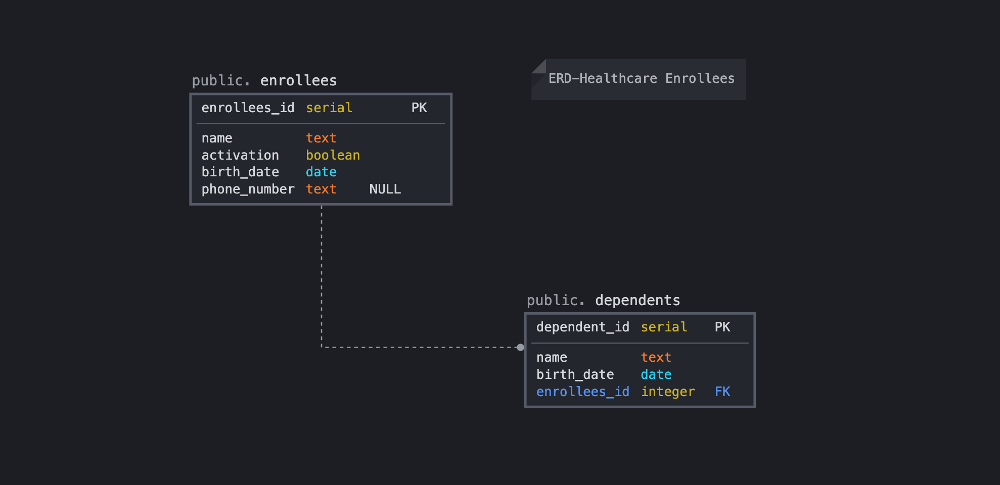
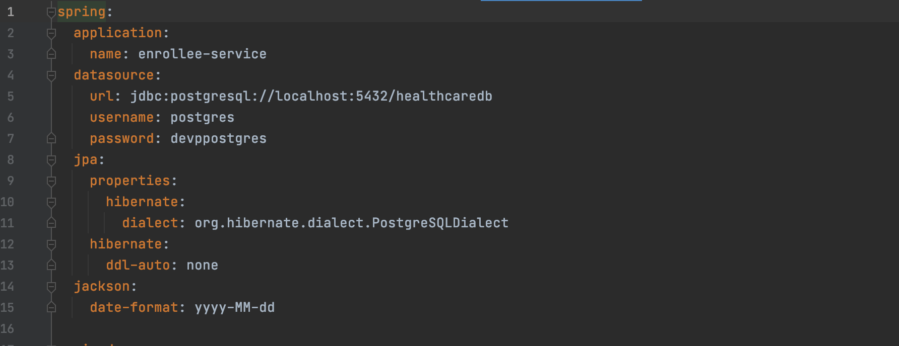
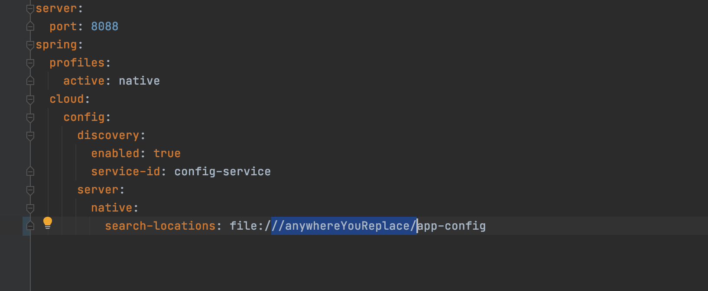
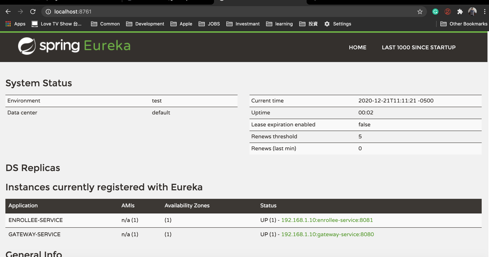
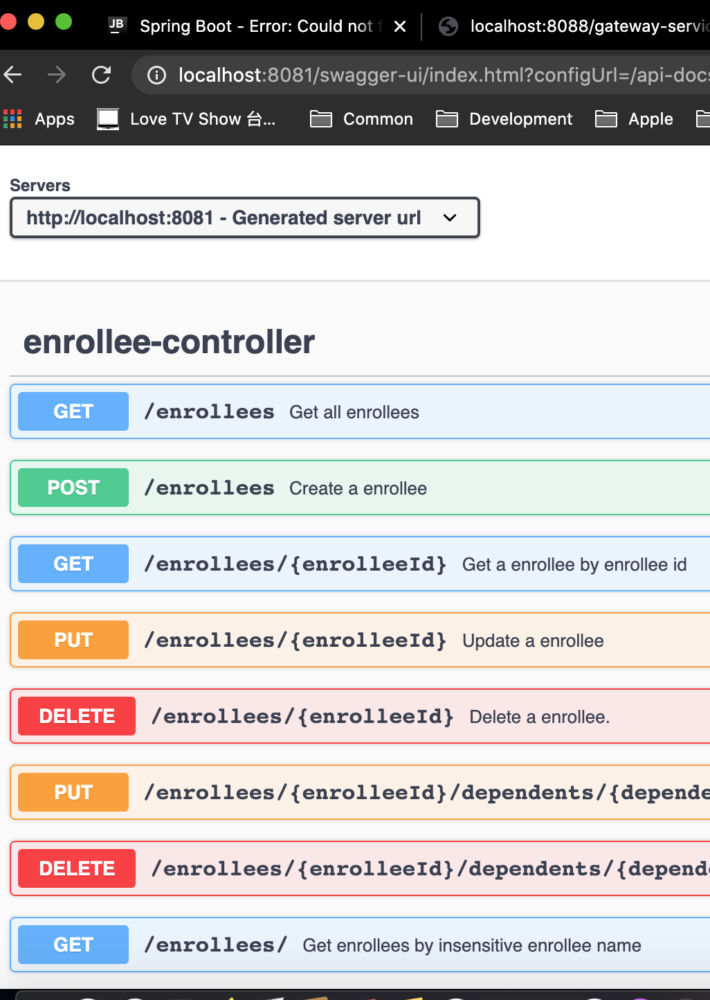

# HealthCare SpringBoot Microservices

###Env Preparation
1. Maven
2. PostgreSQL
3. Docker

### Microservices Structure
- **gateway-service** - a module that Spring Cloud Netflix Zuul for running Spring Boot application that acts as a proxy/gateway in our architecture.
- **config-service** - a module that uses Spring Cloud Config Server for running configuration server in the `native` mode. The configuration files are placed on the classpath.
- **discovery-service** - a module that depending on the example it uses Spring Cloud Netflix Eureka or Spring Cloud Netlix Alibaba Nacos as an embedded discovery server.
- **EnrolleeService** - REST API for enrollee functionalities.

###Database Structure

###Before Run
1. PostgreSQL
   - CREATE DATABASE healthcaredb
    - Modify ddl-auto:none to ddl-auto:create and datasource in ./app-config/enrollee-service.yml
      
    
2. Copy and replace app-config to .../Desktop/dev/ and update search-locations path in 
   config-service/src/main/resources/application.yml
   
4. Run config-service
5. Run discovery-service
   
6. Run enrollee-service and gateway-service ...
7. Revert the change in app-config/enrollee-service.yml for ddl-auto value to be none(ddl-auto:none)
8. SwaggerUI : http://localhost:8081/swagger-ui/index.html?configUrl=/api-docs/swagger-config#/
   
   

