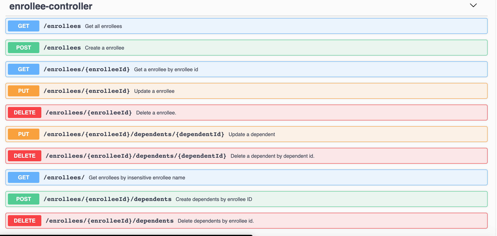

# HealthCare SpringBoot Microservices

###Env Preparation
1. Maven
2. PostgreSQL
3. Docker

### Microservices Structure
- **gateway-service** - a module that Spring Cloud Netflix Zuul for running Spring Boot application that acts as a proxy/gateway in our architecture.
- **config-service** - a module that uses Spring Cloud Config Server for running configuration server in the `native` mode. The configuration files are placed on the classpath.
- **discovery-service** - a module that depending on the example it uses Spring Cloud Netflix Eureka or Spring Cloud Netlix Alibaba Nacos as an embedded discovery server.
- **EnrolleeService** - REST API for enrollee functionalities.

###Database Structure
- **ERD**

###Before Run
1. PostgreSQL
   - CREATE DATABASE healthcaredb
    - Modify datasource in ./app-config/enrollee-service.yml
   
3. Run config-service
4. Run discovery-service
   -
   
5. Run enrollee-service and gateway-service ...
6. SwaggerUI : http://localhost:9092/swagger-ui/index.html?configUrl=/api-docs/swagger-config#/
     - Explore: /v0/apply-service/api-docs
   -
   
   
9. Postman collect export json file: .../healthcare-springboot-microservice/static/Enrollees API.postman_collection.json
   

